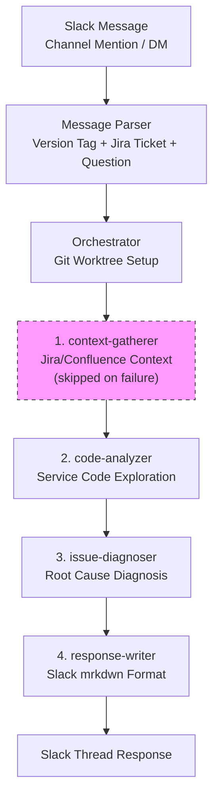

# Oncall Bot

[](https://opensource.org/licenses/MIT)

Korean version: [README.ko.md](./README.ko.md)

A Slack oncall assistant bot that uses Claude Code CLI as a sub-agent orchestrator. It receives incoming tickets/questions via Slack, analyzes them against your service project codebase, and responds with a structured diagnosis.

The bot runs a 4-stage pipeline of Claude Code CLI sub-agents: context gathering (Jira/Confluence) -> code analysis -> issue diagnosis -> response formatting.

## Architecture



### Agent Pipeline

| Stage | Agent | Role | Default Timeout |
|-------|-------|------|-----------------|
| 1 | `context-gatherer` | Collects context from Jira/Confluence (skipped on failure) | 180s |
| 2 | `code-analyzer` | Explores service project code and finds relevant code | 300s |
| 3 | `issue-diagnoser` | Diagnoses root cause based on code analysis results | 300s |
| 4 | `response-writer` | Formats diagnosis into a Slack message | 60s |

Each agent is defined by a CLAUDE.md file in the `agents/` directory and runs as a Claude Code CLI subprocess. On failure, agents retry with exponential backoff (except for timeouts).

### Code Reference Modes

**Local Path Mode** -- When `SERVICE_PROJECT_PATH` is set, the bot uses that local directory directly.

**Git Worktree Mode** -- When `SERVICE_PROJECT_PATH` is not set, the bot bare-clones the target repo and creates a git worktree per request to reference a specific version of the code. Worktrees are automatically cleaned up after analysis.

### Concurrency Control

Semaphore-based concurrency limiting (default: 3 concurrent requests). Excess requests are queued and processed in order. Duplicate processing of the same message is also prevented.

## Features

- Slack integration via Bolt.js (Socket Mode) -- supports channel mentions and DMs
- 4-stage sub-agent pipeline using Claude Code CLI (Claude Agent SDK)
- Jira/Confluence context gathering via Atlassian MCP server
- Git worktree-based version-specific code analysis
- Automatic version selection from Jira affectsVersion/fixVersion fields
- Git diff collection between affected and fix versions
- Structured JSON output with Slack mrkdwn formatting
- Configurable agent timeouts and retry policies
- Semaphore-based concurrency control
- CLI test mode for running analysis without Slack
- Docker support for production deployment

## Tech Stack

- **Runtime**: Node.js 20+ (ES Modules)
- **Language**: TypeScript (strict mode)
- **Slack SDK**: @slack/bolt v4 (Socket Mode)
- **Agent**: Claude Code CLI via @anthropic-ai/claude-agent-sdk
- **Testing**: Vitest
- **Build**: tsc

## Prerequisites

- **Node.js** 20 or higher
- **Git** (required for worktree mode)
- **Claude Code CLI** -- the `claude` command must be installed on your system
- **Slack App** -- a Slack app with Socket Mode enabled
- **Atlassian MCP Server** (optional) -- for Jira/Confluence context gathering

## Setup

### 1. Clone and Install

```bash
git clone https://github.com/alton15/oncall-bot.git
cd oncall-bot
npm install
```

### 2. Environment Variables

```bash
cp .env.example .env
```

Edit the `.env` file with your values. See the full environment variables table below.

### 3. Slack App Setup

1. Create a new app at [Slack API](https://api.slack.com/apps)
2. Enable **Socket Mode** and generate an App-Level Token (`xapp-...`)
3. Enable **Event Subscriptions** and subscribe to `app_mention` and `message.im` events
4. Under **OAuth & Permissions**, add these Bot Token Scopes:
   - `app_mentions:read`
   - `chat:write`
   - `im:history`
   - `reactions:write`
5. Install the app to your workspace and note the Bot Token (`xoxb-...`)

### 4. Atlassian Setup (Optional)

The `context-gatherer` agent uses an Atlassian MCP server to query Jira and Confluence. If you have an MCP server that implements these tools, set the `ATLASSIAN_AGENT_DIR` environment variable to point to its directory:

```env
ATLASSIAN_AGENT_DIR=/path/to/your/atlassian-mcp-server
```

The MCP server must have an `atlassian_mcp` package with a `__main__.py` entry point and support `uv run`. If not configured, the context-gatherer step will be skipped and the bot will proceed with code analysis only.

### 5. Git Repo Configuration

Choose one of two code reference modes:

**Local Path Mode** (if you already have the repo cloned locally):

```env
SERVICE_PROJECT_PATH=/path/to/your/service/project
```

**Git Worktree Mode** (for version-specific analysis via git tags):

Leave `SERVICE_PROJECT_PATH` unset and configure the following:

```env
GIT_REPO_URL=https://github.com/your-org/your-repo
GIT_DEFAULT_REF=main
# GIT_BASE_CLONE_PATH=/tmp/oncall-bot-repo        # optional
# GIT_WORKTREE_BASE_PATH=/tmp/oncall-bot-worktrees # optional
```

For private repos, ensure git credentials are configured (e.g., `GITHUB_TOKEN` in Docker mode).

### 6. Running the Bot

**Development mode** (with hot reload):

```bash
npm run dev
```

**Production build and run**:

```bash
npm run build
npm start
```

**CLI test mode** (without Slack):

```bash
npx tsx src/cli.ts "Your question here"
npx tsx src/cli.ts "PROJ-123 Why is this API returning 500?"
npx tsx src/cli.ts "v1.2.3 Timeout errors after deployment"
```

### 7. Docker Setup

Build and run with Docker Compose:

```bash
docker compose up -d
```

The Docker setup handles:
- Installing Claude Code CLI globally
- Setting up git credentials via `GITHUB_TOKEN`
- Cloning the Atlassian MCP server (if `ATLASSIAN_MCP_REPO_URL` is set)
- Running as a non-root user (required by Claude Code CLI)
- Persistent volumes for git repo cache and MCP server

Make sure to mount your Claude credentials:
- Either mount `~/.claude` volume (after running `claude login` on host)
- Or set `ANTHROPIC_API_KEY` environment variable

### 8. Running Tests

```bash
# Run all tests
npm test

# Watch mode
npm run test:watch

# Type check
npx tsc --noEmit
```

## Environment Variables

| Variable | Required | Default | Description |
|----------|----------|---------|-------------|
| `SLACK_BOT_TOKEN` | Yes | - | Slack Bot OAuth Token (`xoxb-...`) |
| `SLACK_APP_TOKEN` | Yes | - | Slack App-Level Token for Socket Mode (`xapp-...`) |
| `SLACK_SIGNING_SECRET` | Yes | - | Slack Signing Secret |
| `ANTHROPIC_API_KEY` | No | - | Anthropic API key (alternative to Claude CLI login) |
| `SERVICE_PROJECT_PATH` | No | - | Local service project path (disables worktree mode when set) |
| `GIT_REPO_URL` | No | - | Git repo URL for worktree mode |
| `GIT_BASE_CLONE_PATH` | No | `{tmpdir}/oncall-bot-repo` | Bare clone storage path |
| `GIT_WORKTREE_BASE_PATH` | No | `{tmpdir}/oncall-bot-worktrees` | Worktree creation path |
| `GIT_DEFAULT_REF` | No | `develop` | Default git ref when no version is specified |
| `GITHUB_TOKEN` | No | - | GitHub token for private repo access (Docker) |
| `ATLASSIAN_AGENT_DIR` | No | - | Path to Atlassian MCP server directory |
| `ATLASSIAN_MCP_REPO_URL` | No | - | Git URL to clone Atlassian MCP server (Docker) |
| `LOG_LEVEL` | No | `info` | Log level (`debug`, `info`, `warn`, `error`) |
| `LOG_FORMAT` | No | `plain` | Log format (`plain`, `json`) |
| `AGENT_TIMEOUT_CONTEXT_GATHERER_MS` | No | `180000` | context-gatherer timeout (ms) |
| `AGENT_TIMEOUT_CODE_ANALYZER_MS` | No | `300000` | code-analyzer timeout (ms) |
| `AGENT_TIMEOUT_ISSUE_DIAGNOSER_MS` | No | `300000` | issue-diagnoser timeout (ms) |
| `AGENT_TIMEOUT_RESPONSE_WRITER_MS` | No | `60000` | response-writer timeout (ms) |
| `AGENT_MAX_RETRIES` | No | `2` | Number of retries on agent failure |
| `MAX_CONCURRENT_REQUESTS` | No | `3` | Maximum concurrent analysis requests |

## Sub-Agent Architecture

The bot uses four specialized sub-agents, each defined by a CLAUDE.md prompt file in the `agents/` directory. Each agent runs as a separate Claude Code CLI process via the Claude Agent SDK.

### context-gatherer

Collects context from Jira and Confluence using MCP tools. Operates in two modes:
- **Ticket mode**: When Jira ticket numbers are provided, directly queries those issues and related Confluence pages
- **Search mode**: When no tickets are provided, searches Jira/Confluence using keywords extracted from the question

This agent is optional -- if it fails or the MCP server is not configured, the pipeline continues without context.

### code-analyzer

Explores the service project codebase to find code relevant to the reported issue. Uses Grep, Glob, and Read tools to search for error messages, API endpoints, function names, and module names. Limited to 15 tool turns for efficiency.

### issue-diagnoser

Synthesizes the original question, code analysis results, Jira/Confluence context, and version diffs to diagnose the root cause. Categorizes issues as: `bug`, `config`, `infra`, `data`, `dependency`, `usage`, or `unknown`.

### response-writer

Converts the diagnosis into a Slack mrkdwn formatted message (under 2000 characters) with category emoji, confidence level, summary, root cause analysis, impact assessment, and recommended actions.

## Project Structure

```
oncall-bot/
+-- src/
|   +-- index.ts                  # Entry point (bot startup + repo initialization)
|   +-- cli.ts                    # CLI test runner (without Slack)
|   +-- config/
|   |   +-- index.ts              # Environment variable configuration
|   +-- slack/
|   |   +-- app.ts                # Slack Bolt app instance (Socket Mode)
|   |   +-- handlers.ts           # Mention/DM event handlers
|   +-- agent/
|   |   +-- orchestrator.ts       # 4-stage agent pipeline orchestration
|   |   +-- output-parser.ts      # Agent output JSON parsing
|   |   +-- __tests__/
|   +-- utils/
|       +-- agent-runner.ts       # Claude Agent SDK wrapper
|       +-- git-repo.ts           # Git bare clone / worktree management
|       +-- message-parser.ts     # Version tag + Jira ticket parsing
|       +-- version-selector.ts   # Version selection priority logic
|       +-- errors.ts             # Custom error types
|       +-- logger.ts             # Structured logger (plain / JSON)
|       +-- retry.ts              # Exponential backoff retry utility
|       +-- semaphore.ts          # Concurrency control
|       +-- __tests__/
+-- agents/                       # Sub-agent CLAUDE.md definitions
|   +-- CLAUDE.md                 # Common agent guidelines
|   +-- context-gatherer/
|   |   +-- CLAUDE.md             # Jira/Confluence context collection
|   +-- code-analyzer/
|   |   +-- CLAUDE.md             # Code exploration and analysis
|   +-- issue-diagnoser/
|   |   +-- CLAUDE.md             # Root cause diagnosis
|   +-- response-writer/
|       +-- CLAUDE.md             # Slack response formatting
+-- .env.example
+-- docker-compose.yml
+-- Dockerfile
+-- docker-entrypoint.sh
+-- package.json
+-- tsconfig.json
+-- vitest.config.ts
```

## License

MIT
